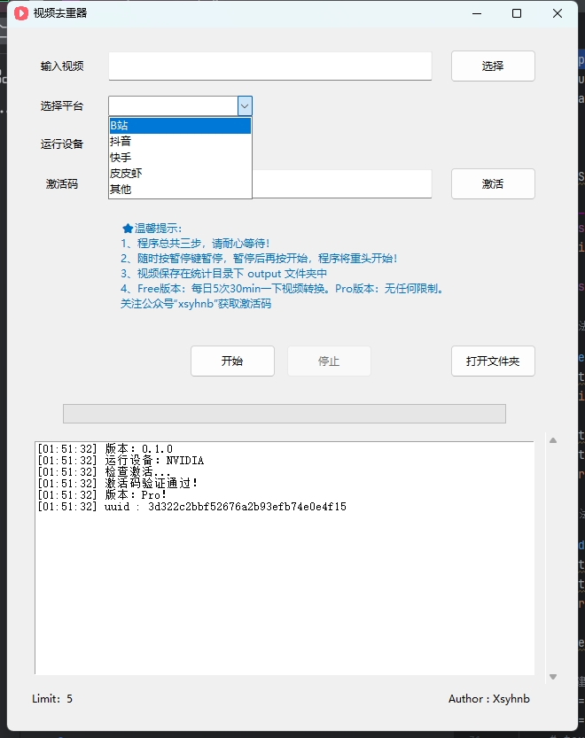

# 视频去重器 (VideoChecker)

[](https://your-badge-link-here)

>  **简洁高效的视频去重解决方案，帮助您快速清理重复视频，节省存储空间。**

## ✨ 功能特点 (Features)

*   **一键快速处理视频:**  程序化繁为简，仅需四个步骤即可完成视频去重，操作简单易上手。
*   **随时暂停与重头开始:**  在程序运行过程中，您可以随时按下暂停键暂停，方便灵活控制流程。 暂停后再次点击开始，程序将立即从头开始执行，确保操作的灵活性。
*   **输出结果清晰可见:**  去重后的视频文件将自动保存在 `统计目录` 下的 `output` 文件夹中，方便您进行后续的管理和查看。
*   **广泛的视频格式支持:**  支持多种主流视频格式输入，包括 MP4, AVI, MOV, MKV, WMV 等，满足您多样化的视频去重需求。


**温馨提示：**

*   程序总共包含四个步骤，请在操作过程中耐心等待每个步骤完成。
*   您可以随时按下界面上的 **暂停** 按钮来暂停程序运行。
*   暂停后，如果您再次按下 **开始** 按钮，程序将会从**第一个步骤重新开始**执行。

## 📦 运行 (Run)

使用的是python 3.10的版本

安装依赖
~~~
pip install -r requirements.txt
~~~

运行
```
python VideoHybridizer.cpython-310.pyc
```
## 直接下载
也可以下载编译好的exe文件
* 夸克网版：https://pan.quark.cn/s/f6b01200c1d3
* 百度网版：https://pan.baidu.com/s/1v2VZKX7X0zH7uP4XYFD1bQ?pwd=jzdq 提取码: jzdq
* 谷歌网盘：https://drive.google.com/file/d/1EnvstnM55Sp_mtQJbG5V-UiFOONYuzGv/view?usp=sharing
  

